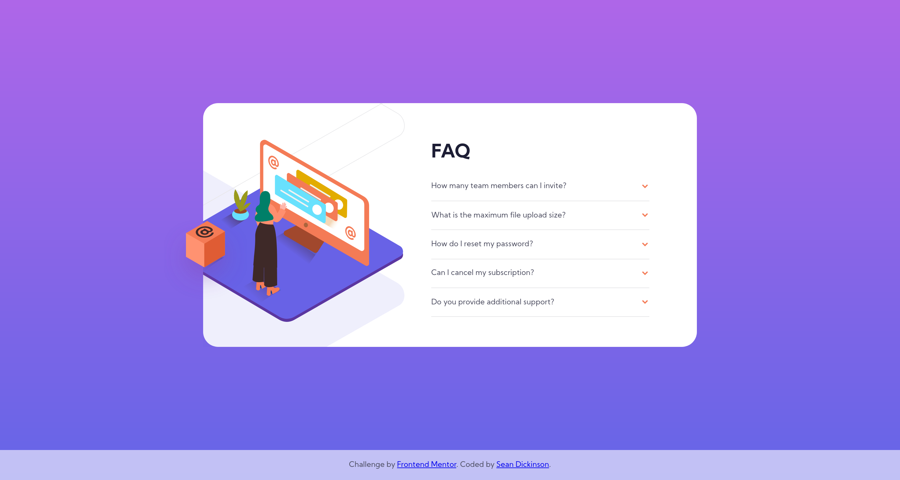

# Frontend Mentor - Profile card component solution

This is a solution to the [FAQ accordion card challenge on Frontend Mentor](https://www.frontendmentor.io/challenges/faq-accordion-card-XlyjD0Oam). Frontend Mentor challenges help you improve your coding skills by building realistic projects.

## Table of contents

- [Overview](#overview)
  - [The challenge](#the-challenge)
  - [Screenshot](#screenshot)
  - [Links](#links)
- [My process](#my-process)
  - [Built with](#built-with)
- [Author](#author)

## Overview

### The challenge

- Build out the project to the designs provided

### Screenshot

### Links

- Solution URL: [https://github.com/atinybeardedman/faq-accordion-card](https://github.com/atinybeardedman/faq-accordion-card)
- Live Site URL: [https://peaceful-shannon-f1cc51.netlify.app/](https://peaceful-shannon-f1cc51.netlify.app/)

## My process

I approached this faq card using a mobile first workflow. I was hoping to acheive the accordion component using the native html summary and detail elements, however I found that they were lacking in support for styling, transitions, and even accessibility. Thus, I sacrificed sematics for styling and accessibility and used an unordered list.

I found the accordion to be fun to implement, especially adding the transition states. It's tricky to implement with auto height for the answers to the questions, so I ended up using a simple javascript function to calculate the expected height to allow the css transitions to function correctly.

I had a very difficult time deciding on the best markup and css to acheive the 2 different layouts for the illustrations for mobile and desktop. I finally settled on using background images for all but the standalone box that needs to overflow the container on desktop. I found these images to be rather frustrating in the way they were given in the project as they included extra whitespace, and also were separated in ways that I thought only complicated the project. I ended up having to set some offsets explicitly with values that "look" right, but don't have much rhyme or reason. It acheives the goal, but it's a very inelegant solution.

### Feedback

- I would love to know if there's some easier way to handle the illustrations. Particularly on desktop, as I found my current solution to be lacking.

### Built with

- Semantic HTML5 markup
- Flexbox
- Mobile-first workflow

## Author

- Website - [Sean Dickinson](https://seandickinson.dev)
- Frontend Mentor - [@atinybeardedman](https://www.frontendmentor.io/profile/atinybeardedman)
